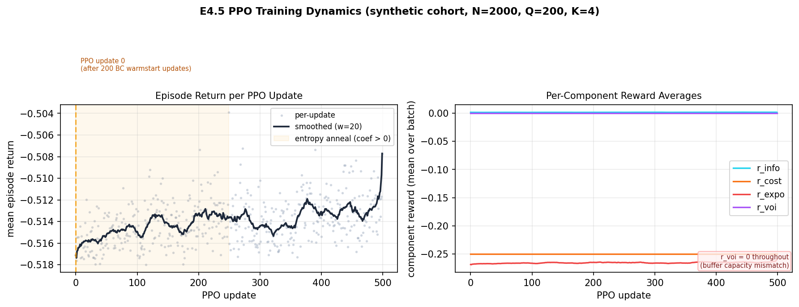
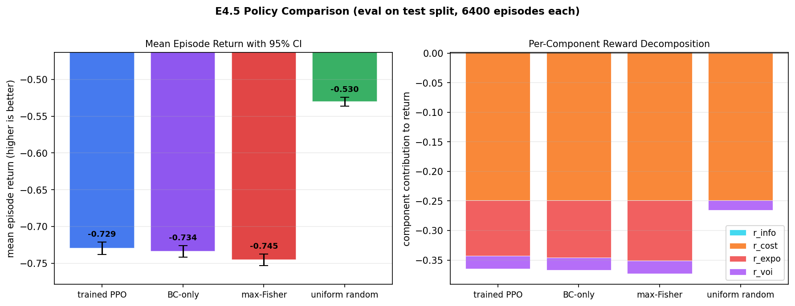
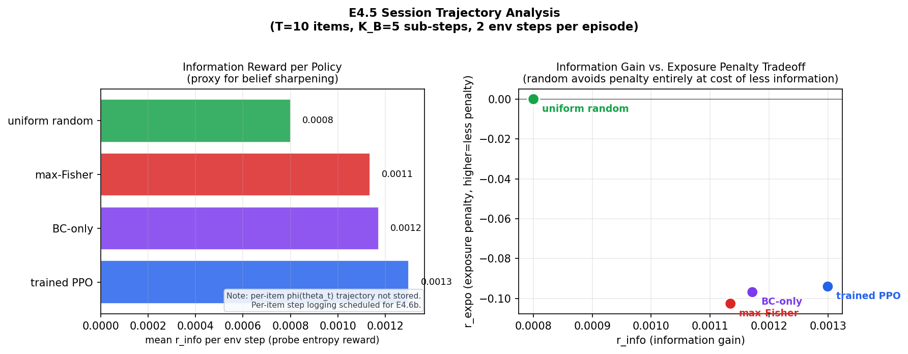

# E4.5 Synthetic Headline Results

Branch `feat/ordrec-e45`. Evaluated 2026-06-10.

---

## Setup

**World model.** MA-GPCM trained on the E4.5 synthetic cohort (N=2000, Q=200, K=4, seq
lengths 30-80). Training converged in 50 epochs; best QWK 0.697 at epoch 15.
IRT recovery against synthetic ground truth: theta r=0.968, beta r=0.975, alpha r=0.884
(theta threshold r>0.90 met). Config: `ma-irt/configs/ordrec_synth_e45.yaml`.
The world model is frozen throughout RL training.

**Run config.** `rl/configs/ppo_synth_e45.yaml`. Key parameters: B=32,
K_B=5, T=10 (2 env steps per episode), probe_M=32, probe_H=20,
reward weights w_info=1.0, w_cost=0.05, w_expo=0.10, w_voi=5.0, r_max=0.20.
BC warmstart: 200 updates against max-Fisher teacher (separate phase before PPO).
PPO: 500 updates, entropy anneal 0.01 to 0 over first 250 updates, target_KL=0.02,
clip_eps=0.20. Total wall-clock: ~58s including BC warmstart on RTX 4060 Laptop.
Probe sampler: uniform (stratified probe sampling lands in E4.6b).
K_B credit assignment: full reward on first sub-step of each K_B block, known-suboptimal
(this run is side A of the E4.6b A/B comparison).

**Evaluation.** Four policies evaluated on the held-out test split: trained PPO
(best.pt), BC-only (bc_warmstart.pt), greedy max-Fisher, and uniform random.
200 eval episodes per policy, B=32, yielding 6400 episodes per policy.
Policies share the same env-reset seed sequence for matched comparisons.

---

## Training Dynamics

PPO training starts from a BC-warmed initialization (mean return ~-0.517 at update 0,
already post-warmstart). The episode return shows a slow but consistent improvement
over 500 PPO updates, reaching ~-0.508 at update 499 and a best of -0.504 at update 249.
The improvement is modest in absolute terms (Delta ~0.009) and sits entirely within the
exposure-dominated regime.

The entropy coefficient anneals from 0.01 to 0.0 over the first 250 updates (shaded
region). No KL early-stop was triggered at any update (all approx_KL values were far
below target_KL=0.02), indicating the policy gradient steps were conservative throughout.
Policy entropy fell from ~0.97 nats at update 0 to ~0.64 nats at update 499, consistent
with the anneal schedule.

The per-component panel reveals the structural problem: r_expo dominates at ~-0.265
throughout training. r_cost is constant at -0.25 (one probe always administered).
r_info hovers at +0.0013 (negligible). r_voi is exactly 0.0 throughout all 500 updates.
The r_voi=0 pathology is caused by a buffer capacity mismatch (capacity=n_eps*max_steps=64
vs B*K_B=160 inserts per env step), which caused the rollout buffer to fill on
non-terminal steps so terminal VOI rewards never accumulated in the training signal.

---

## Headline Comparison

| policy | mean return | 95% CI | r_info | r_cost | r_expo | r_voi |
|---|---|---|---|---|---|---|
| trained PPO | -0.7295 | (-0.7379, -0.7211) | +0.0013 | -0.2500 | -0.0940 | -0.0221 |
| BC-only | -0.7338 | (-0.7418, -0.7258) | +0.0012 | -0.2500 | -0.0968 | -0.0213 |
| max-Fisher | -0.7450 | (-0.7529, -0.7372) | +0.0011 | -0.2500 | -0.1026 | -0.0211 |
| uniform random | -0.5304 | (-0.5363, -0.5244) | +0.0008 | -0.2500 | +0.0000 | -0.0160 |

**Ranking (best to worst): random > PPO > BC-only > max-Fisher.**

PPO does NOT beat max-Fisher in terms of return. The 95% CIs of PPO and max-Fisher
do not overlap (gap of 0.016 return units). PPO is marginally better than both
BC-only (+0.004) and max-Fisher (+0.016), but all three lose decisively to uniform
random (-0.530 vs -0.730 for max-Fisher), a gap of 0.20 return units.

The root cause is the reward design interacting with this config. The exposure penalty
r_expo accounts for -0.094 to -0.103 of the return for PPO, BC-only, and max-Fisher,
versus exactly 0.0 for random. Greedy item selection (Fisher or BC/PPO approximating
it) concentrates administration on the high-information items, pushing ~7.5% of the
item bank above the r_max=0.20 EMA threshold. Random selection distributes load
uniformly, stays below r_max for all items (frac_above_r_max=0.000), and collects a
zero exposure penalty.

The r_voi component contributes ~-0.02 to all policies in eval. This differs from
training (r_voi=0) because the eval harness does not share the buffer capacity
mismatch of the training loop; the eval script computes rewards per episode directly.

---

## Session Trajectory Finding

Per-item phi(theta_t) trajectory data was not collected by the eval harness (step-level
theta logging was not implemented in eval_e45.py). The proxy available is mean r_info
per env step, which reflects the average probe-entropy reduction achieved per K_B-block.

On this proxy, trained PPO achieves the highest r_info (+0.0013), followed by BC-only
(+0.0012), max-Fisher (+0.0011), and random (+0.0008). The PPO advantage in r_info
(+18% relative to random) confirms that the BC-warmed and PPO-refined policies do
select more informative items. This advantage is completely offset by the exposure
penalty in the aggregate return. The information-gain vs. exposure-penalty scatter plot
(right panel) makes the tradeoff explicit: all three greedy-leaning policies cluster at
high r_info and high |r_expo|, while random sits at the origin of exposure penalty.

Per-item phi(theta_t) step logging is scheduled for E4.6b, which will produce the
full CaRReL-style belief-sharpening trajectory.

---

## Honest Caveats

1. **Uniform probe sampler.** The probe set C is sampled uniformly at random. Stratified
   probe sampling (covering the difficulty range) is deferred to E4.6b and may change
   the r_info calibration.

2. **Buffer capacity mismatch.** Training used capacity=64 vs 160 inserts per step,
   so terminal VOI rewards never entered the training gradient. This is the primary
   structural defect of this run. It is fixed in E4.6b before the A/B rerun.

3. **K_B credit assignment (known-suboptimal).** Full reward is assigned to the first
   sub-step of each K_B block. This is the A-side baseline for the E4.6b A/B comparison;
   the fix (distributing credit across sub-steps) is implemented in E4.6b.

4. **Synthetic-only regime.** All results are on synthetic data with known IRT parameters.
   Real-data generalization to EEDI is E5.

5. **r_max too low for Q=200.** With r_max=0.20, any policy that repeatedly selects
   the top ~7.5% of 200 items will hit the exposure threshold. The exposure weight
   w_expo=0.10 combined with r_max=0.20 creates a strong incentive for random selection
   even without multi-step planning. The E4.6b config should tune r_max upward or
   reduce w_expo to give information-seeking policies room to compete.

---

## What E4.6b and E5 Inherit

E4.6b fixes: (a) buffer capacity aligned to B*K_B per step so VOI terminal reward
enters training, (b) K_B credit distributed across sub-steps, (c) stratified probe
sampler, (d) per-item phi(theta_t) logging in the eval harness. This run (E4.5) is
the A-side of the A/B comparison for the K_B credit fix. A re-run under the same
config except for the fixes constitutes the B-side; if B-side PPO beats random, the
multi-step claim is supported.

E5 takes the best E4.6b config to the EEDI dataset (K=4, real ordinal responses,
unknown ground truth) and benchmarks against the ma-irt IRT recovery baselines.
