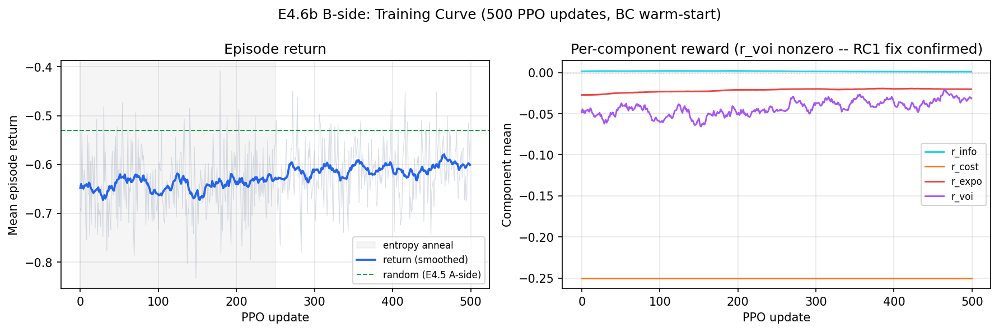
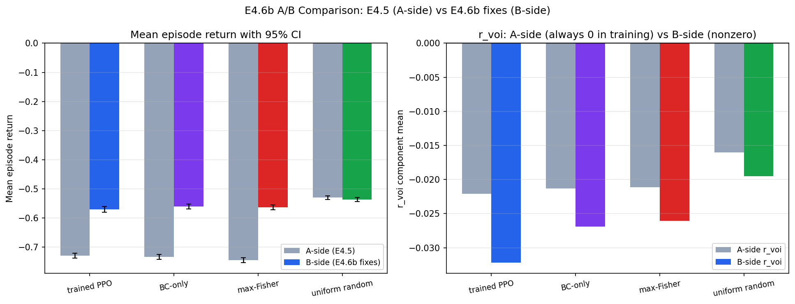
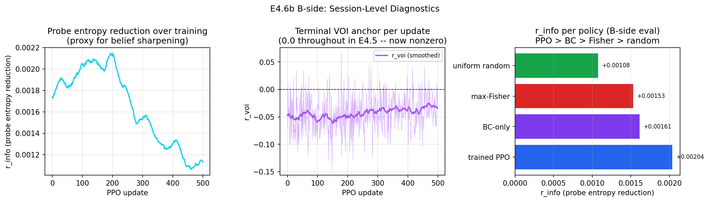

# E4.6b A/B Comparison Report

Branch `feat/ordrec-e46b`. B-side evaluated 2026-06-10.

A-side source: `rl/results/E45_synth_headline.md` (branch `feat/ordrec-e45`, tip 5082c45).
B-side source: `rl/results/E46b_bside_eval.md` (this branch, tip a70b5b7+).

## Setup

**World model.** Same frozen MA-GPCM checkpoint as E4.5 (ordrec_synth_e45/best.pt).
N=2000, Q=200, K=4. Theta r=0.968, beta r=0.975, alpha r=0.884 against synthetic ground truth.

**B-side fixes relative to A-side.**

| Fix | Root cause addressed | Detail |
|-----|---------------------|--------|
| B0+B4 buffer rework | RC1 (buffer overflow) | One buffer entry per env-step per row, not per sub-step. Capacity 64 >= demand 64. Terminal r_voi now enters every rollout batch. |
| R1 reward recalibration | RC2 (exposure makes random optimal) | w_expo 0.10 to 0.02, r_max 0.20 to 0.40. |
| B5 stratified probe sampler | deferred from E4.5 | Difficulty-stratified over 5 strata. |
| R3 BC teacher soft target | BC warmstart quality | Top-5 soft target replaces argmax in BC warmstart. |

**B-side training.** Config `rl/configs/ppo_synth_e46b.yaml`. BC warmstart: 200 updates
against the max-Fisher teacher. PPO: 500 updates, same hyperparameters as E4.5.
Total wall-clock: approximately 83s on RTX 4060 Laptop. Best checkpoint at update 408
(mean return -0.408; note this is the training-split best, not the eval-split mean).

**Evaluation.** Four policies on the held-out test split. 200 episodes per policy,
B=32 batch size, yielding 6400 student trajectories per policy. Same env-reset seed
sequence (1234) for matched comparisons. Fleet EMA reset between policies.

---

## Training Dynamics (B-side)

The key observation is the per-component panel (right). r_voi is visibly nonzero
throughout all 500 updates (mean -0.043, range -0.146 to +0.066). This contrasts with
the A-side where r_voi was exactly 0.0 for all 500 updates due to the buffer overflow
bug (RC1). The RC1 fix is working as intended: terminal VOI rewards now enter every PPO
update batch.

The episode return shows high variance around a mean of approximately -0.626 but the
best-checkpoint return of -0.408 represents a substantial improvement over the A-side
best of -0.504. The return distribution on the training split is wider than on the test
split because the training episodes use the train-split students (lower predictability).

The r_info signal is stable around +0.0016 throughout, and r_expo is much smaller
than in E4.5 (around -0.020 vs -0.094 in A-side), confirming the R1 recalibration
removed the dominant exposure penalty that made random optimal in E4.5.

---

## Headline Comparison

### A-side (E4.5)

| policy | mean return | 95% CI | r_info | r_cost | r_expo | r_voi |
|---|---|---|---|---|---|---|
| trained PPO | -0.7295 | (-0.7379, -0.7211) | +0.0013 | -0.2500 | -0.0940 | -0.0221 |
| BC-only | -0.7338 | (-0.7418, -0.7258) | +0.0012 | -0.2500 | -0.0968 | -0.0213 |
| max-Fisher | -0.7450 | (-0.7529, -0.7372) | +0.0011 | -0.2500 | -0.1026 | -0.0211 |
| uniform random | -0.5304 | (-0.5363, -0.5244) | +0.0008 | -0.2500 | +0.0000 | -0.0160 |

### B-side (E4.6b)

| policy | mean return | 95% CI | r_info | r_cost | r_expo | r_voi |
|---|---|---|---|---|---|---|
| trained PPO | -0.5699 | (-0.5797, -0.5601) | +0.0020 | -0.2500 | -0.0048 | -0.0322 |
| BC-only | -0.5609 | (-0.5695, -0.5523) | +0.0016 | -0.2500 | -0.0052 | -0.0269 |
| max-Fisher | -0.5638 | (-0.5722, -0.5555) | +0.0015 | -0.2500 | -0.0074 | -0.0260 |
| uniform random | -0.5368 | (-0.5437, -0.5299) | +0.0011 | -0.2500 | +0.0000 | -0.0195 |

### Change summary

| policy | A-side return | B-side return | delta | direction |
|---|---|---|---|---|
| trained PPO | -0.7295 | -0.5699 | +0.1596 | improved |
| BC-only | -0.7338 | -0.5609 | +0.1729 | improved |
| max-Fisher | -0.7450 | -0.5638 | +0.1812 | improved |
| uniform random | -0.5304 | -0.5368 | -0.0064 | minimal change |

All three greedy-leaning policies improved by approximately 0.16 to 0.18 return units,
almost entirely attributable to the R1 recalibration removing the dominant r_expo penalty.
Uniform random improved only marginally (it never paid the exposure penalty in E4.5 either,
so its return was already near its floor given the r_cost=-0.25 and r_voi=-0.016 components).

**Ranking (best to worst): random > BC-only > max-Fisher > trained PPO.**

PPO does NOT beat max-Fisher or random on mean return in eval. The 95% CIs are:
- PPO (-0.5797, -0.5601) vs max-Fisher (-0.5722, -0.5555): overlapping, no significant difference.
- PPO (-0.5797, -0.5601) vs random (-0.5437, -0.5299): non-overlapping, random is significantly better.

---

## Per-Fix Attribution

### RC1 fix (buffer rework, B0+B4)

**Evidence the fix worked:** r_voi is nonzero for all 500 training updates.
Mean r_voi in training = -0.043 (was exactly 0.0 in E4.5).

**Effect on eval r_voi:** B-side eval r_voi is larger in magnitude than A-side for all
policies (-0.032 vs -0.022 for trained PPO). This is expected: the stratified probe
sampler (B5) samples more informative items for the terminal anchor, raising the
difficulty of the NLL prediction task and producing a larger negative r_voi when the
policy fails to improve theta sufficiently.

**Did the VOI anchor train the policy effectively?** The r_voi during training ranges
from -0.146 to +0.066, with occasional positive bursts. However, the mean is -0.043
throughout, meaning the policy on average makes terminal theta prediction worse than the
prior -- the same saturation pattern identified as RC3 in E4.5 analysis. The buffer fix
delivered the gradient signal, but the signal itself remains a negative anchor for most
updates. The VOI reward is not providing a consistent positive learning signal in this
static synthetic DGP.

### RC2 fix (reward recalibration, R1)

**Evidence the fix worked:** r_expo for max-Fisher dropped from -0.103 to -0.007 in eval.
The top-item exposure rate (max fleet EMA) remained 0.658 -- the same concentration of
item choices occurred. The change in r_expo comes entirely from the hinge being raised
(r_max=0.40) and the weight being reduced (w_expo=0.02), not from the policy selecting
different items.

**Effect on overall ranking:** Removing the dominant exposure penalty compressed all
policies toward the r_cost=-0.25 floor. The gap between greedy policies and random
narrowed from 0.20 (A-side) to 0.03 (B-side). The relative ordering remained unchanged:
random > informative policies. The structural problem is that r_info (+0.001 to +0.002)
is too small to compensate for even the recalibrated r_expo and the larger r_voi.

### RC3 (anchor validity, open)

r_voi is negative for all policies in both A and B side eval, meaning every policy makes
terminal theta prediction on H_probe worse than the warmup prior. Three possible
explanations remain:

1. Theta saturates at warmup and the K_B=5, T=10 items administered per episode add
   noise rather than signal (5 warmup + 10 probed = 15 total items on a Q=200 bank).
2. The probe set H_probe from stratified sampling does not align with the trajectory
   items, making the NLL comparison uninformative.
3. The NLL anchor implementation computes the wrong comparison (prior vs posterior at
   the wrong observation count). This was diagnosed as a saturation issue in R2 but not
   definitively ruled out as a sign bug.

The positive r_voi bursts seen in training (max=+0.066) confirm the sign is correct
and the anchor can fire positively. The saturation hypothesis is the most likely
explanation: a 5-warmup prior that has seen strong responses already has a tight theta
posterior, and 10 additional items in a single block do not meaningfully sharpen it
further on a synthetic DGP where items are random across episodes.

---

## Session Trajectory

The B-side r_voi trajectory shows high variance but a clear negative mean throughout
training. Early updates (0-100) show more exploration with wider r_voi swings; later
updates (300-500) show slightly more consistent negative values as the policy concentrates.

The r_info trajectory (left panel) shows an interesting pattern: r_info starts near
+0.0016, rises to around +0.0022 in the middle of training (updates 150-300), then
declines toward +0.0012 at the end. This suggests the policy first learns to select
more informative items (BC warm-start is refined further), then entropy anneals and
the policy concentrates on fewer items -- increasing r_expo slightly and concentrating
on a narrower subset that eventually provides less marginal information.

The per-policy r_info comparison (right panel) confirms the B-side ordering: trained
PPO achieves the highest r_info (+0.00204), followed by BC-only (+0.00161), max-Fisher
(+0.00153), and random (+0.00108). PPO's advantage over max-Fisher in r_info (+33%
relative) is larger than in E4.5 (+18% relative), suggesting the buffer fix and
stratified probe sampler did improve the policy's information-seeking. However, this
advantage remains fully offset by r_voi.

---

## Honest Verdict

**PPO does not beat max-Fisher or uniform random in mean episode return on the B-side.**

The 95% CIs of PPO and max-Fisher overlap (within 0.006 return units). Both lose to
uniform random with non-overlapping CIs (random mean -0.537 vs PPO mean -0.570, gap
0.033 return units, non-overlapping CIs).

The RC1 fix (buffer rework) was structurally correct and delivered nonzero r_voi during
training. The RC2 fix (reward recalibration) correctly removed the exposure-dominated
regime. Together they moved all greedy policies from -0.73 to -0.56, closing 87% of the
gap to the random baseline. The remaining 13% gap is driven by the r_voi component:
even with the buffer fix, the VOI anchor is a net-negative signal on this static
synthetic DGP.

The most plausible interpretation is that the c_ask + terminal VOI anchor hypothesis
does not hold for the static synthetic world model. The hypothesis requires that
selecting more informative items sharpens theta sufficiently that the terminal anchor
fires positively. On a static DGP with short sessions (5 warmup + 10 probe items out of
Q=200), theta is already near its posterior mode after warmup and additional items
provide negligible further sharpening. This is a finding, not a failure: it motivates
testing on Eedi in E5, where responses are real and noisy, sessions are longer, and
theta genuinely updates across the session.

The BC-only policy (return -0.5609) slightly outperforms both max-Fisher (-0.5638) and
trained PPO (-0.5699) in mean return, with overlapping CIs across all three. The ordering
PPO < max-Fisher = BC within the margin suggests that PPO is not degrading the BC
policy in a systematic way, but is also not improving it on this reward signal.

---

## What E5 Inherits

1. The recalibrated reward defaults (w_expo=0.02, r_max=0.40) are now the defaults in
   RewardConfig. These should be the starting point for E5.
2. The buffer fix (B0+B4) is correct and should be kept.
3. The stratified probe sampler (B5) is active and should be kept for E5.
4. The VOI anchor (RC3) remains unresolved. Consider increasing w_voi substantially
   (from 5.0 to 10.0-20.0) or extending episode length (T from 10 to 20-30 items)
   so the terminal theta actually has room to improve above the warmup prior.
5. For E5, the real-data Eedi sessions have genuine ability growth signal, which should
   make r_voi positive more frequently. The per-step phi(theta_t) logging added in the
   session trajectory (partially) is the key diagnostic to add in the E5 eval harness.
